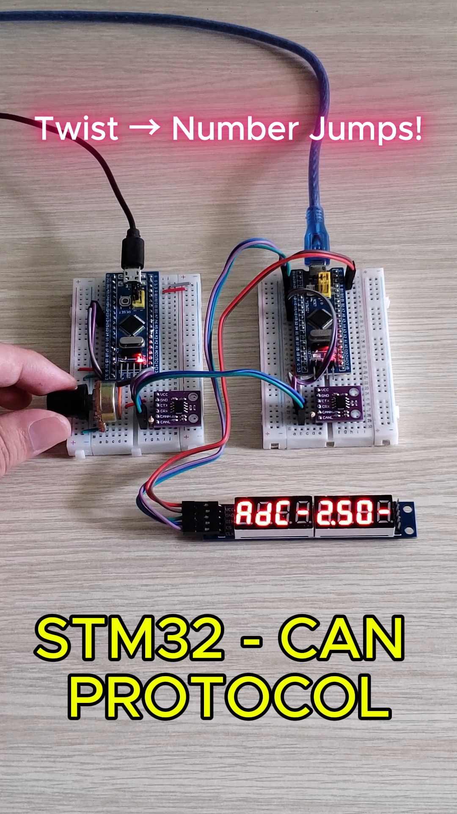

# STM32 | CAN Communication with MCP2551 & MAX7219 🔗✨

Author: **Kaël Shelby** (VTN)

---

## 📖 1. Introduction
This project demonstrates **CAN bus communication** between two **STM32F103C8T6** microcontrollers using the **MCP2551 CAN transceiver**.  

- **STM32 #1 (Transmitter):** Reads the potentiometer value (PA0) and sends the data via CAN (PA11, PA12).  
- **STM32 #2 (Receiver):** Receives the ADC value through CAN and displays the result on an **8-digit 7-segment LED** driven by **MAX7219 via SPI2**.  

This project covers:  
- **ADC** (Analog-to-Digital Converter) on STM32  
- **CAN bus communication** with MCP2551  
- **SPI peripheral communication** with MAX7219  
- Multi-microcontroller embedded system design  

<div align="center">
  
</div>

---

## 🛠️ 2. Hardware Requirements
To build this project, you will need:  
- 2 × STM32F103C8T6 (Blue Pill)  
- 2 × MCP2551 CAN Transceiver modules  
- 1 × Potentiometer (~10kΩ)  
- 1 × MAX7219 8-digit 7-segment LED module  
- Breadboard, jumper wires, USB-TTL or ST-Link programmer  

---

## 🔌 3. Circuit Diagram


### STM32 #1 (Transmitter)
| Device          | STM32 Pin | Function   |
|-----------------|-----------|------------|
| Potentiometer   | PA0       | ADC Input  |
| CAN Transmit    | PA12      | CAN_TX     |
| CAN Receive     | PA11      | CAN_RX     |

### STM32 #2 (Receiver)
| Device          | STM32 Pin | Function   |
|-----------------|-----------|------------|
| CAN Transmit    | PA12      | CAN_TX     |
| CAN Receive     | PA11      | CAN_RX     |
| MAX7219 (SPI2)  | PB15      | MOSI       |
| MAX7219 (SPI2)  | PB13      | SCK        |
| MAX7219 (SPI2)  | PB12      | CS (LOAD)  |

---

## 🎥 4. Demo and Results
👉 [Watch the demo video](https://www.tiktok.com/@kshelbyiot/video/7535692422366465287?is_from_webapp=1&sender_device=pc&web_id=7500959777037518344)

<p align="center">
  <a href="https://www.tiktok.com/@kshelbyiot/video/7535692422366465287?is_from_webapp=1&sender_device=pc&web_id=7500959777037518344">
    
  </a>
</p>

---

## 🔄 5. Working Principle
1. **STM32 #1 (Transmitter):**  
   - Reads potentiometer value (0–4095) via ADC  
   - Packs the data into a CAN frame (Standard ID: 0x123)  
   - Sends the frame via MCP2551  

2. **STM32 #2 (Receiver):**  
   - Receives the CAN frame with ID 0x123  
   - Extracts the ADC value  
   - Converts it to decimal format  
   - Displays it on the MAX7219 7-segment display  

---

## 🚀 6. Getting Started
1. **Clone the project from GitHub**  
   ```bash
   git clone <url>
2. **Open the project with Keil C (uVision)**
- Main source file: main.c (2 files)
3. **Connect hardware according to the diagram in Section 3**
4. **Flash the firmware using ST-Link V2 or USB-UART**
5. **Expected Results:**
- The potentiometer value read by STM32 #1 is transmitted via CAN.
- STM32 #2 receives the data and displays it on the MAX7219 7-segment LED in real time.
- The system responds quickly, with smooth value changes when adjusting the potentiometer.

## 📌 7. Future Improvements
- Add CAN filters to accept only specific message IDs → increases stability in multi-node networks.
- Implement threshold-based alerts (e.g., value > 3000).
- Expand into a multi-node CAN network (3–4 STM32 boards communicating simultaneously).
- Integrate with LCD/OLED displays for richer data visualization.
- Real-world applications: remote sensor monitoring, distributed measurement systems, or CAN bus automotive simulations.


